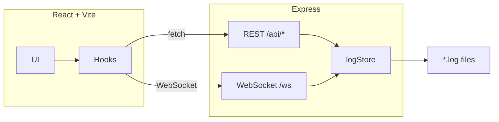

# AEM Log Viewer

> Real-time tailing, filtering, and managing of AEM/Sling logs — locally.


## Quick Start

```bash
npm install
npm run build
npm run start
# → http://127.0.0.1:3333
```

### Custom log directory

Create `.env` after build (`npm run prod`):

```env
LOG_ROOT=path/to/logs
PORT=3333  # optional, default 3333
```

## Features

- **Real-time tail** via WebSocket
- **Multi-tab** — open several logs at once
- **Filter** by log level (`INFO`, `DEBUG`, …) and Java package
- **Truncate** log files from the UI
- **Persistence** — remembers paths in `localStorage` or `.env`

## Architecture



## Requirements

- **Node.js** ≥ 18
- **Windows**, **macOS**, or **Linux**

## Security

Binds to `127.0.0.1` — local development only.

## License

MIT